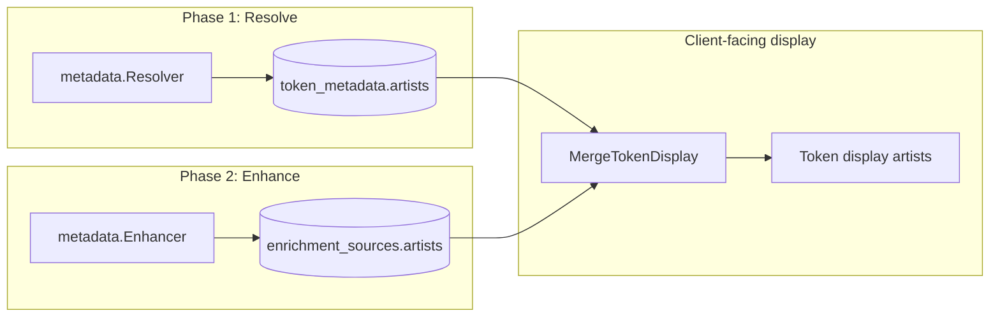

# Artist name and DID resolution

This document explains how **artist display names** and **`did:pkh` identifiers** are produced and where they are stored. It reflects the implementation in `internal/domain/did.go`, `internal/metadata/resolver.go`, `internal/metadata/enhancer.go`, and `internal/workflows/core_executor.go`.

---

## DID format (`did:pkh`)

The indexer constructs **W3C-compatible** public-key-hash DIDs using [`did:pkh`](https://github.com/w3c-ccg/did-pkh):

```text
did:pkh:<chain-identifier>:<wallet-address>
```

In code, `domain.NewDID(address, chain)` lowercases both the chain segment and the address and formats:

`did:pkh:` + `string(chain)` + `:` + `address`

Examples (shape only): `did:pkh:eip155:1:0x…`, `did:pkh:tezos:mainnet:tz1…`.

**Constraints:**

- If there is **no wallet address** to bind (e.g. name-only from traits), the **DID is left empty**; the API may still expose `name`.
- Addresses must be valid for the expected chain where the code checks them (e.g. Objkt creators use `types.IsTezosAddress`).

---

## Two phases: on-chain metadata vs vendor enrichment

Artist information is produced in **two layers**. Both use the same logical `Artist` shape (`did` + `name`) but are **persisted separately** and **merged for display**.

| Phase | Code path | Stored in | Typical DID? |
|-------|-----------|-----------|----------------|
| **1. Resolve** | `metadata.Resolver.Resolve` → `ResolveTokenMetadata` (executor) | `token_metadata` (including `artists` JSONB) | FA2 from `creators`; Ethereum often **name-only** |
| **2. Enhance** | `metadata.Enhancer.Enhance` → `EnhanceTokenMetadata` (executor) | `enrichment_sources` (including `artists` JSONB) | Vendors that return artist **addresses** |

**API display:** `MergeTokenDisplay` (see `internal/api/shared/dto/token_display.go`) starts from `token_metadata`, then **overrides** fields from enrichment when present. For artists specifically: if enrichment has **any** artists (`len(enrichment.Artists) > 0`), **those replace** metadata artists for the unified display response.



---

## Phase 1 — On-chain / URI metadata (`Resolver`)

### Ethereum ERC-721 and ERC-1155 (OpenSea-style JSON)

After fetching `tokenURI` / `uri` JSON, normalization uses **`normalizeOpenSeaMetadataStandard`**.

**Artist name** comes only from **`resolveArtistName(metadata)`** — there is **no** Ethereum creator address in this path, so **`DID` is always empty** for these entries.

`resolveArtistName` checks, in order:

1. Top-level string **`artist`**
2. **`attributes`** array: first trait where `trait_type` matches (case-sensitive in code) one of: `artist`, `Artist`, `Creator`, `creator`, `Artists`, `artists` — then uses **`value`**
3. **`collection_name`**: if it contains `" by "`, uses the part **after** `" by "`
4. **`createdBy`**, **`created_by`**, **`creator`** (string)

### Tezos FA2 (TZIP-21)

Metadata is loaded from TzKT (`GetTokenMetadata`). **`creators`** is parsed as a list of **addresses** (strings). For **each** creator address:

- **`DID`** = `NewDID(creator, chainID)` (so FA2 routinely gets a **pkh DID** per creator).
- **`Name`** = `resolveArtistName(metadata)` when that returns a non-empty string; otherwise the **`Name` field is set to the same string as the creator entry** (the Tezos address from the `creators` list).

Reference: [TZIP-21](https://tzip.tezosagora.org/proposal/tzip-21/).

---

## Phase 2 — Vendor enrichment (`Enhancer`)

The enhancer runs **after** normalization. Routing depends on **publisher registry** (from contract/deployer) and **chain** (`internal/metadata/enhancer.go`).

| Condition | Vendor path | Artist / DID behavior |
|-----------|-------------|------------------------|
| Publisher **Art Blocks** (EVM) | Art Blocks Hasura API | **`DID`** from `project.ArtistAddress` + token chain; **`Name`** from `ArtistName`. If `ArtistAddress` is empty, **no artists** are added. |
| Publisher **Feral File** (mainnet ETH / Tezos) | Feral File artwork API | Picks artist wallet from `Series.Artist.AlumniAccount.Addresses["ethereum" \| "tezos"]`; **`DID`** via `NewDID`; **`Name`** from `Alias`. |
| Tezos, not Feral File | Objkt API | One entry per **`token.Creators`** with valid Tezos **`Holder.Address`**; **`DID`** + optional **`Alias`** as name. |
| Ethereum mainnet, no known publisher | OpenSea API | **`ExtractArtistFromTraits`** for **name**; **no wallet** → **`DID` empty** (name-only). OpenSea may be skipped if no API key (`ErrNoAPIKey`). |

### OpenSea trait heuristic

`opensea.ExtractArtistFromTraits` matches trait types (case-insensitive) against: `artist`, `artists`, `creator`, `artist name`, `creator name`, `made by`, `created by`. It deduplicates values and joins multiple matches with `", "`.

---

## End-to-end in the indexing workflow

During **`IndexTokenMetadata`** (`internal/workflows/index_metadata_wf.go`):

1. **`ResolveTokenMetadata`** persists **on-chain** normalized fields (including `token_metadata.artists`).
2. **`EnhanceTokenMetadata`** may write **`enrichment_sources`** with vendor `artists` and set enrichment level to **vendor** in the same transactional pattern as other enrichment fields.

Clients that need a **single** artist list for UI should use the **merged display** path (or apply the same rule: prefer enrichment artists when present).

---

## Related code references

| Topic | Location |
|-------|----------|
| DID construction | `internal/domain/did.go` |
| Name + ERC/FA2 normalization | `internal/metadata/resolver.go` (`resolveArtistName`, `normalizeOpenSeaMetadataStandard`, `normalizeTZIP21Metadata`) |
| Vendor artists | `internal/metadata/enhancer.go` |
| Persist metadata vs enrichment | `internal/workflows/core_executor.go` (`ResolveTokenMetadata`, `EnhanceTokenMetadata`) |
| Display merge | `internal/api/shared/dto/token_display.go` (`MergeTokenDisplay`) |
| OpenSea trait names | `internal/providers/vendors/opensea/client.go` (`ExtractArtistFromTraits`) |

Persistence columns: [`docs/schema.md`](schema.md) — `token_metadata.artists`, `enrichment_sources.artists`.
