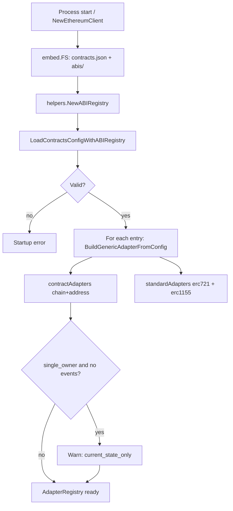
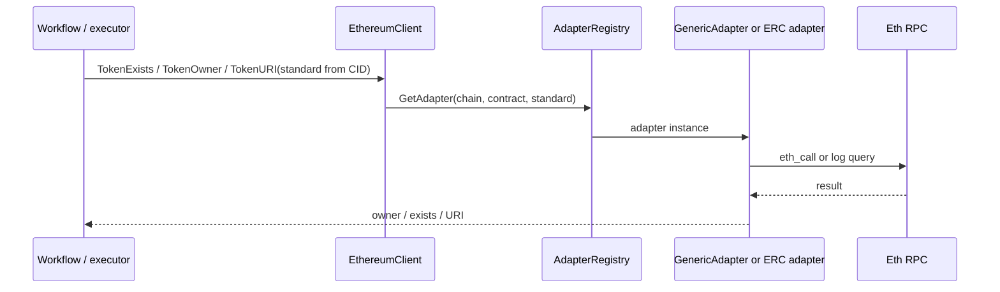
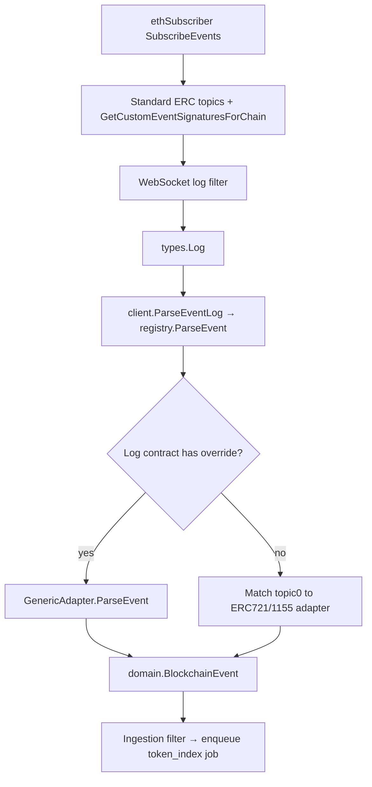

# Ethereum contract adapters (legacy & configured contracts)

This guide explains how FF-Indexer v2 indexes **Ethereum contracts that are not plain ERC-721 or ERC-1155** — for example **CryptoPunks**, which shipped before EIP-721 and uses custom methods and events instead of `ownerOf` / `Transfer`.

It is written for developers who want to **understand the design before contributing** a new override, fix adapter behavior, or trace a token through ingestion and workflows.

For product scope and guardrails, see [`business_requirements.md`](business_requirements.md) and [`constraints.md`](constraints.md) (configured override section). For end-to-end job and queue behavior, see [`indexing_flows.md`](indexing_flows.md). For deployment topology, see [`architecture.md`](architecture.md).

---

## 1. Problem and approach

### What breaks with “standard-only” indexing?

The default Ethereum path assumes:

| Concern | ERC-721 | ERC-1155 |
|--------|---------|----------|
| Exists? | `ownerOf` does not revert | `balanceOf` / supply semantics |
| Current owner | `ownerOf` | Per-holder `balanceOf` |
| Metadata URI | `tokenURI` | `uri` |
| Ownership history | `Transfer` logs | `TransferSingle` / `TransferBatch` |
| Live subscription | Standard event topic0 hashes | Standard event topic0 hashes |

**Legacy contracts** may use different method names, pack token IDs in non-indexed log data, emit non-EIP event signatures, or have **no** usable on-chain metadata URI (metadata only from vendors).

### Design choice: configuration over hard-coding

Instead of one-off Go code per famous contract, the indexer ships:

1. **`contracts.json`** — declarative routing per `(chain, contract_address)`
2. **`abis/*.json`** — minimal ABI fragments for configured calls and events
3. **`GenericAdapter`** — one implementation that executes the config
4. **`AdapterRegistry`** — resolves override vs standard adapter at runtime

Contract-specific **repair** logic (when chain data is wrong but fixable) stays in Go only when necessary; see [§8 Contract-specific repair](#8-contract-specific-repair-cryptopunks-example).

---

## 2. Component map

```text
internal/providers/ethereum/
├── contracts/
│   ├── embed.go          # go:embed contracts.json + abis/
│   ├── contracts.json    # shipped overrides (edit to add contracts)
│   └── abis/             # ABI JSON referenced by config
├── registry/
│   ├── config.go         # load + validate contracts.json
│   └── registry.go       # AdapterRegistry: lookup, ParseEvent, subscriptions
├── adapters/
│   ├── types.go          # ContractAdapter interface, ownership_model → CID standard
│   ├── erc721.go         # standard ERC-721
│   ├── erc1155.go        # standard ERC-1155
│   ├── generic.go        # config-driven legacy adapter
│   ├── ownership.go      # replay helpers (single_owner / multi_holder)
│   └── cryptopunks_repair.go  # PunkBought receipt repair
├── client.go             # EthereumClient → registry → adapters
└── subscriber.go         # merges custom event topics into WS filter
```

**Dependency direction:** `EthereumClient` → `AdapterRegistry` → `ContractAdapter` → `helpers` / `internal/adapter.EthClient` (RPC). Workflows and ingestion call **`EthereumClient`**, not adapters directly.

---

## 3. Three kinds of adapter

| Adapter | When used | Provenance | Token CID `standard` |
|---------|-----------|------------|----------------------|
| **ERC721Adapter** | No override; token CID says `erc721` | Always | `erc721` |
| **ERC1155Adapter** | No override; token CID says `erc1155` | Always | `erc1155` |
| **GenericAdapter** | `(chain, address)` in `contracts.json` | Only if `adapter.events` is non-empty | **Derived** from `ownership_model` (see below) |

### `ownership_model` vs token CID label

Configured contracts do **not** set `erc721` / `erc1155` in JSON. Operators set **`ownership_model`**, which drives both indexing semantics and the external standard label:

| `ownership_model` | Indexing semantics | CID / API `standard` |
|-------------------|--------------------|----------------------|
| `single_owner` | Last transfer wins; one holder at a time | `erc721` |
| `multi_holder` | Balance accumulation across holders | `erc1155` |

The registry **rejects** a lookup when the token CID’s standard does not match the configured contract’s derived standard (`ErrConfiguredStandardMismatch`). That prevents persisting a Punk as `erc1155` or mixing replay rules.

---

## 4. Configuration (`contracts.json`)

Shipped file: [`internal/providers/ethereum/contracts/contracts.json`](../internal/providers/ethereum/contracts/contracts.json).

### Minimal mental model

Each entry defines **how to talk to the contract on-chain**:

```json
{
  "chain": "eip155:1",
  "address": "0x...",
  "name": "Human-readable name",
  "ownership_model": "single_owner",
  "adapter": {
    "existence": { "method": "...", "abi": "...", "params": ["${tokenId}"], "success_condition": "..." },
    "owner":     { "method": "...", "abi": "...", "params": ["${tokenId}"] },
    "metadata":  { "source": "vendor_only" },
    "events":    [ /* optional; required for multi_holder */ ]
  }
}
```

### Method calls

- **`${tokenId}`** in `params` is replaced with the token ID as `uint256` for `eth_call`.
- **`success_condition`** (existence only):
  - `no_revert` — call succeeded ⇒ token exists
  - `address_nonzero` — returned address non-zero ⇒ exists; zero owner with this condition ⇒ `ErrTokenNotFoundOnChain` (not “burned holder”)

### Metadata

| `metadata.source` | Behavior |
|-------------------|----------|
| `vendor_only` | `TokenURI` returns empty; resolver skips on-chain URI; vendors (e.g. OpenSea) enrich |
| `on_chain` | Requires `metadata.method`; adapter performs configured `eth_call` for URI |

### Custom provenance events

Legacy contracts emit non-EIP logs. Each `adapter.events[]` entry describes how to decode a log into a **`domain.BlockchainEvent`**:

| Field | Role |
|-------|------|
| `signature` | Solidity event string → Keccak256 topic0 |
| `mapToStandardEvent` | `transfer`, `mint`, `burn`, or `metadata_update` |
| `indexedParams` / `dataParams` | Names in topic / data order (v1: 32-byte slots) |
| `parameterMappings` | Maps param names → `FromAddress`, `ToAddress`, `TokenNumber`, `Quantity` |

After parsing, **ownership replay** uses the same single-owner / multi-holder rules as standard adapters (`adapters/ownership.go`).

### Validation at startup

`registry.LoadContractsConfig` fails process startup on invalid config (unknown ABI, duplicate address, `multi_holder` without `events`, invalid mappings, etc.). See `registry/config.go` and tests in `registry/config_test.go`.

### Limited indexing mode (`single_owner` without `events`)

Allowed: contract loads with **`SupportsProvenance() == false`**. Startup logs a **warning** with `indexing_mode=current_state_only` and disabled capabilities (no owner sweeps, no live provenance for that contract, no full provenance jobs).

| Capability | Supported in current-state-only? |
|------------|----------------------------------|
| `POST /api/v1/tokens/index` (explicit token CID) | Yes |
| Current owner via configured `owner` call | Yes |
| Metadata (vendor or on-chain) | Yes |
| Address owner sweeps | No |
| Real-time ingestion for this contract | No |
| Full provenance / ownership webhooks from chain | No |

`multi_holder` **without** `events` is **rejected** at startup — balance replay has no log source.

---

## 5. Startup: registry construction



At runtime, **`GetAdapter(chain, contractAddress, standard)`**:

1. If override exists for `(chain, address)` → return `GenericAdapter` **only if** `standard` matches `entry.CIDStandard()`
2. Else → `ERC721Adapter` or `ERC1155Adapter` by `standard`
3. Else → `ErrUnsupportedContractStandard`

---

## 6. Runtime flows

### 6.1 Explicit token indexing (API or workflow)

When a workflow indexes a token by CID (see [`indexing_flows.md`](indexing_flows.md) §3–4), Ethereum paths call the client:



**Provenance:** `coreExecutor.SupportsTokenProvenance(tokenCID)` calls `ethClient.SupportsProvenance`. If false, **full provenance jobs are skipped**; minimal owner state may still come from `TokenOwner` on `single_owner` contracts.

### 6.2 Live chain ingestion



**Parse order** (`registry.ParseEvent`):

1. Configured adapter for `vLog.Address` (if override exists)
2. Else standard adapters by matching `topics[0]` to known signatures
3. Else `ErrUnconfiguredContract` (known custom topic, wrong contract) or `ErrUnexpectedEvent`

Configured contracts **without** `events` do not contribute custom topics; their logs are not parsed as NFT events for that address.

### 6.3 Owner address sweeps

`GetTokenCIDsByOwnerAndBlockRange` (used by Ethereum owner indexing):

1. Collects **ERC721**, **ERC1155**, and every configured override with **`SupportsProvenance() == true`**
2. Each adapter returns **owner-scoped raw logs** in the block range (`GetOwnerLogs`)
3. Client **merges, deduplicates**, then **`ReplayOwnerTokensWithLimit`** with `ParseLog` → `registry.ParseEvent`
4. Emits token CIDs using configured contract’s derived standard where applicable

**Global lower bound:** `ethereum_token_sweep_start_block` applies to all contracts, including legacy overrides. Tokens whose last ownership event is **before** that block will not appear in sweeps until a later in-range event occurs.

### 6.4 Per-token provenance history

`GetTokenEvents` on the selected adapter:

- **Standard:** filter standard Transfer / TransferSingle (+ URI for 1155) from genesis, filter by token ID
- **Generic:** filter configured event signatures; post-filter by token ID when ID is not indexed in topics; may run **CryptoPunks PunkBought repair** (§8)

Parsed events feed provenance persistence when `SupportsProvenance()` is true.

### 6.5 Metadata resolution

`TokenURI` → adapter:

- Standard: `tokenURI` / `uri`
- Generic + `vendor_only`: empty string → metadata workflow uses vendors only
- Generic + `on_chain`: configured method call

See [`indexing_flows.md`](indexing_flows.md) §5 for resolve → enrich → viewability → media.

---

## 7. Reference example: CryptoPunks (mainnet)

Shipped override uses:

- **Existence / owner:** `punkIndexToAddress` with `address_nonzero`
- **Metadata:** `vendor_only` (no on-chain URI)
- **Events:** `PunkTransfer`, `Assign`, `PunkBought` mapped to mint/transfer

Token CIDs remain:

`eip155:1:erc721:0xb47e3cd837ddf8e4c57f05d70ab865de6e193bbb:<punkIndex>`

Even though the contract is not EIP-721, the **`erc721` label means “single-owner semantics”**, not “this contract implements EIP-721.”

---

## 8. Contract-specific repair (CryptoPunks example)

Some on-chain data cannot be fixed in JSON alone. **`cryptopunks_repair.go`** handles corrupted `PunkBought` logs from `acceptBidForPunk` (zero buyer in the sale log) by loading the transaction receipt and copying the buyer from an internal `Transfer` in the same transaction.

Repair runs in:

- `ParseEvent` (live ingestion)
- `GetTokenEvents` / owner replay paths that load historical logs

When adding another legacy contract, **prefer config-only** parsing first; add Go repair only with tests proving the on-chain anomaly.

---

## 9. Contributor checklist: add a legacy contract

### 1. Decide scope

| Question | If “no” |
|----------|---------|
| Callable existence + owner (or balance) methods? | Likely out of scope |
| Need wallet sweep / live ingestion? | Must configure `adapter.events` |
| Multi-holder balances? | `ownership_model: multi_holder` + full event mapping |
| Metadata only off-chain? | `metadata.source: vendor_only` |

### 2. Add ABI fragment

Create `internal/providers/ethereum/contracts/abis/<name>.json` with only the methods/events you need.

### 3. Add `contracts.json` entry

- Match **chain** CAIP-2 id (`eip155:1`, `eip155:11155111`, …)
- Use normalized **address** (validation accepts hex; registry keys by chain+address)
- Pick **`ownership_model`** for semantics (not for “real” EIP standard)
- Map every provenance event you need for sweeps and ingestion

### 4. Test

| Layer | Location |
|-------|----------|
| Config validation | `registry/config_test.go` |
| Generic adapter behavior | `adapters/generic_test.go` (use `BuildGenericAdapterFromConfig` + mocked `EthClient`) |
| Registry routing | `registry/registry_test.go` |
| Client integration | `client_adapter_test.go`, `client_ownership_test.go` |

Run:

```bash
go test ./internal/providers/ethereum/...
```

For substantive changes, run `make check` per [`AGENTS.md`](../AGENTS.md).

### 5. Docs and constraints

- Update [`docs/constraints.md`](constraints.md) if capability or compatibility guardrails change
- Mention the contract in PR description; no need to duplicate full schema here — field reference remains in [`architecture.md`](architecture.md#contract-adapter-system-ethereum)

---

## 10. Errors and observability

| Error | Meaning | Typical handling |
|-------|---------|------------------|
| `ErrConfiguredStandardMismatch` | Token CID standard ≠ override’s derived standard | Fail lookup; fix CID or config |
| `ErrUnsupportedContractStandard` | No adapter for standard | Fail |
| `ErrUnknownEvent` | Override adapter: topic not in config | Try next path in `ParseEvent` |
| `ErrUnconfiguredContract` | Known custom topic, unconfigured address | Debug log, skip |
| `ErrUnexpectedEvent` | Unknown topic (filter drift) | Error log, tolerate |

Debug logs on routing include `adapter_type` (concrete Go type). Startup logs override counts per chain and **current-state-only** warnings.

---

## 11. How this ties to indexing flows

| User / operator action | Legacy contract **with** `events` | **current-state-only** (no `events`) |
|------------------------|-----------------------------------|--------------------------------------|
| `POST /tokens/index` | Full token + metadata; provenance if supported | Owner snapshot + metadata; no provenance chain |
| `POST /tokens/addresses/index` | Included in sweep if events in range | **Not** discovered via sweep |
| Chain mint/transfer for contract | Ingested like standard events after parse | **Not** subscribed / not parsed for contract |
| `IndexTokenProvenances` job | Runs when `SupportsProvenance()` | Skipped |

---

## 12. Related reading

- [`architecture.md`](architecture.md) — contract adapter system summary and `contracts.json` field list
- [`indexing_flows.md`](indexing_flows.md) — queues, job kinds, metadata pipeline
- [`constraints.md`](constraints.md) — configured override guardrails
- [`internal/providers/ethereum/adapters/types.go`](../internal/providers/ethereum/adapters/types.go) — `ContractAdapter` interface
- [`internal/providers/ethereum/registry/registry.go`](../internal/providers/ethereum/registry/registry.go) — routing and `ParseEvent`
