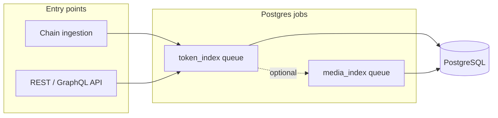
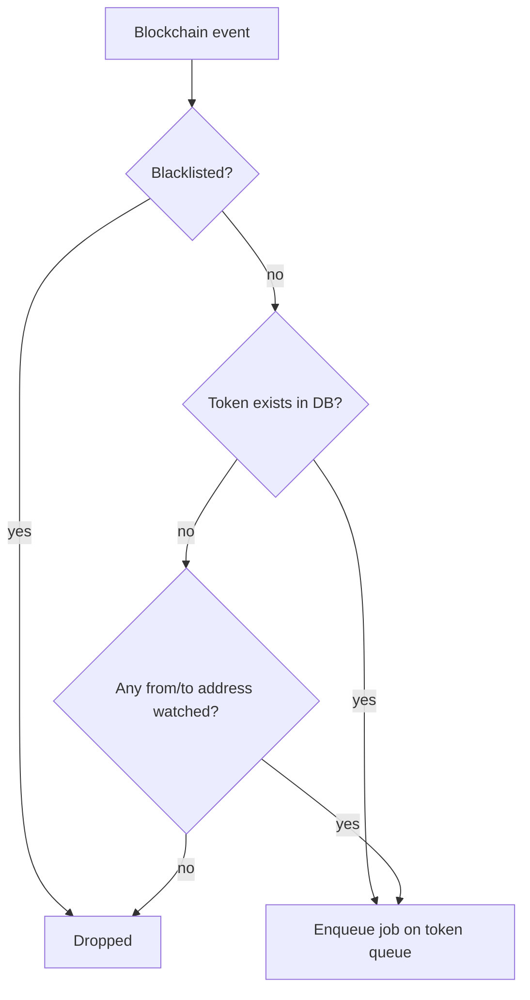
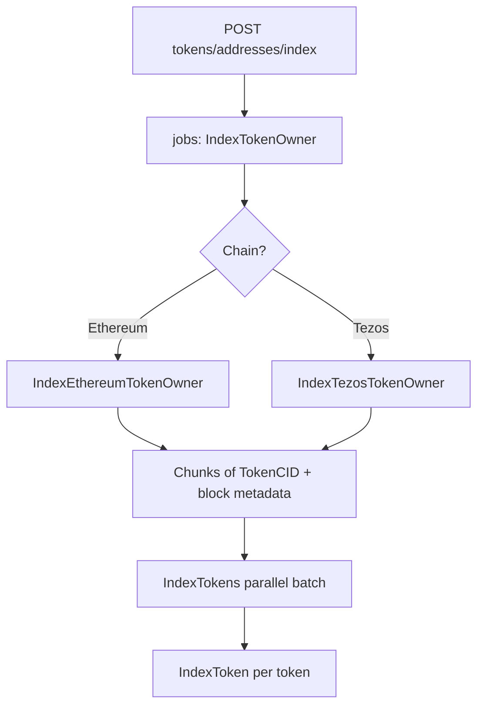
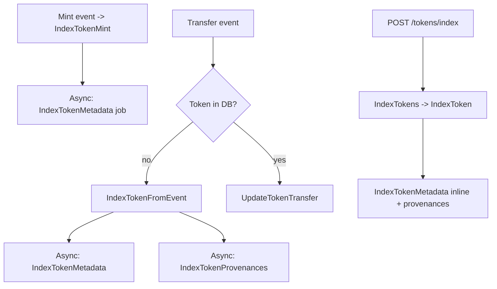
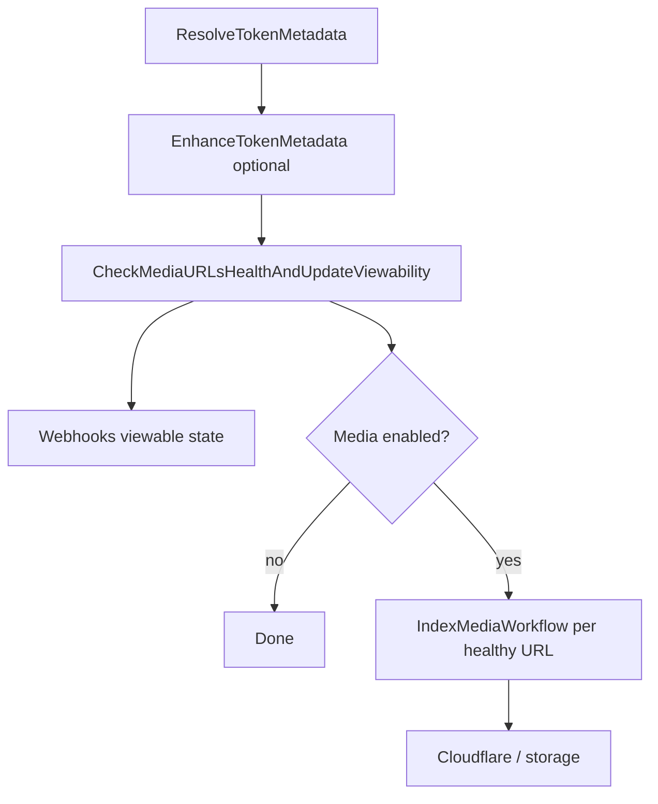

# Indexing flows

This document explains the main **work paths** in FF-Indexer v2: how work enters the system, which **PostgreSQL `jobs` queue** handles it, and how **metadata resolution**, **vendor enrichment**, and **media processing** chain together.

It is derived from the current implementation (`internal/workflows`, `internal/ingestion`, `internal/api`). For deployment topology and durability trade-offs, see [`architecture.md`](architecture.md). For product scope, see [`business_requirements.md`](business_requirements.md).

---

## 1. Two ways work enters the system

| Path | What triggers it | Typical use |
|------|------------------|-------------|
| **Chain ingestion** | Live Ethereum / Tezos events after subscribers normalize them | Keep the database aligned with the chain for **tracked** tokens and **watched** addresses |
| **HTTP API** | Authenticated or open endpoints (see OpenAPI) | Backfill, refresh metadata, or index everything for a wallet |

Both paths enqueue **rows in `jobs`** on the `token_index` queue (token workflows) and optionally on `media_index` (when media processing is enabled).

---

## 2. Chain ingestion: event to handler

At a high level:

1. Ingestion subscribes to chain events and buffers them by block.
2. After a **successful block flush**, the durable cursor advances (see [`architecture.md`](architecture.md)).
3. Each event is **filtered** before a job is created.
4. Accepted events enqueue a job whose `kind` selects the worker handler.

**Filter (`shouldProcessEvent`)** — simplified:

- **Blacklisted** contract / token CID → event dropped.
- If the **token row already exists** in the database → event **accepted** (ongoing lifecycle for that token).
- If the token **does not** exist yet → the event is accepted only if **`from` or `to` matches a row in `watched_addresses`** for that chain (owner-based watch list). Otherwise the event is dropped *for ingestion* (operators can still use API indexing).

**Job kind mapping** from event type (see `internal/ingestion/runner.go`):

| Event type | Job `kind` |
|------------|------------|
| Mint | `IndexTokenMint` |
| Transfer | `IndexTokenTransfer` |
| Burn | `IndexTokenBurn` |
| Metadata update | `IndexMetadataUpdate` |
| Metadata update (range) | Currently ignored at enqueue time |

---

## 3. Flow A — Index tokens for a wallet address (owner sweep)

**API (authenticated):** `POST /api/v1/tokens/addresses/index` (and GraphQL `triggerAddressIndexing`).

**Orchestration:**

1. The API normalizes addresses, detects **Ethereum vs Tezos**, and enqueues one queue job: `kind = IndexTokenOwner`, `args = [address]`.
2. If an **active** address job already exists, the API returns that job instead of duplicating work.
3. Worker runs `IndexTokenOwner`, which branches to **`IndexEthereumTokenOwner`** or **`IndexTezosTokenOwner`**.

**Owner indexing strategy (both chains)** — conceptually:

- Ensure a **`watched_addresses`** row exists (budget / quota defaults apply when budgeted mode is on).
- Load the last **indexed block range** for that address (for resumability).
- Query upstream (RPC / TzKT, etc.) for **token IDs + block numbers** in ranges, sort **newest-first**, split into **chunks** that do not split a block across chunks.
- For each chunk: **`IndexTokens`** with the **owner address passed through** (important for ERC-1155 / FA2 behavior).

**What `IndexToken` does for one token** (`internal/workflows/index_token_wf.go`):

1. **`IndexTokenWithMinimalProvenancesByTokenCID`** — create/update the token and minimal ownership state from chain queries.
2. **`IndexTokenMetadata`** — runs **inline in this workflow** (not only async) so owner-wide backpressure applies.
3. **`IndexTokenProvenances`** — full provenance history, **skipped** for ERC-1155 when an owner address is supplied (address-scoped path).

This differs slightly from **pure chain-driven** mint handling, where metadata is often **enqueued asynchronously** (see §4).

---

## 4. Flow B — Index one or more specific tokens (API or chain)

### 4.1 Manual / API trigger

**API (open):** `POST /api/v1/tokens/index` with token CIDs → enqueues **`IndexTokens`** with `[tokenCIDs, null]` (no owner context).

That batch job calls **`IndexToken`** per token (parallelism capped), same core steps as in §3 (`minimal provenances` → **`IndexTokenMetadata`** → **`IndexTokenProvenances`**, with the ERC-1155 + address rule only when an address is passed).

### 4.2 Chain-driven mint

**`IndexTokenMint`**:

1. **`CreateTokenMint`** — persist mint / token row as implemented.
2. **`IndexTokenMetadata`** — scheduled **asynchronously** via the job queue (`IndexTokenMetadata` job, dedup key per token CID).
3. Optional webhook notification for ownership minted.

### 4.3 Chain-driven transfer (token not in DB yet)

**`IndexTokenTransfer`** when **`CheckTokenExists`** is false:

- Runs **`IndexTokenFromEvent`** (full catch-up for a first-seen token):
  1. **`IndexTokenWithMinimalProvenancesByBlockchainEvent`**
  2. Async **`IndexTokenMetadata`**
  3. Async **`IndexTokenProvenances`** — **skipped for ERC-1155** at this entry point (see `IndexTokenFromEvent`).

When the token **already exists**, the workflow only **`UpdateTokenTransfer`** and webhooks.

---

## 5. Flow C — Metadata: resolve, enrich, viewability, media

This is implemented mainly in **`IndexTokenMetadata`** (`internal/workflows/index_metadata_wf.go`).

**Step 1 — Resolve (on-chain / URI)**

- **`ResolveTokenMetadata`** fetches and normalizes metadata:
  - **ERC-721:** `tokenURI` path
  - **ERC-1155:** `uri()` path
  - **FA2:** Tezos indexer / API path used by the executor

Content may be IPFS, Arweave, HTTP, or data URIs; results are persisted via the store layer (see [`schema.md`](schema.md) — `token_metadata`, hashes for change detection).

**Step 2 — Enhance (optional vendors)**

- **`EnhanceTokenMetadata`** may call vendor APIs (Art Blocks, fxhash, OpenSea, …) and populate **`enrichment_sources`**; failures are **non-fatal**.

**Step 3 — Viewability**

- **`CheckMediaURLsHealthAndUpdateViewability`** probes media URLs derived from resolved + enriched metadata, updates **`tokens.is_viewable`**, and drives webhook “viewable / unviewable” notifications.

**Step 4 — Media pipeline (optional)**

- If **`media` is disabled** in config, no media jobs are created.
- If enabled and URLs are healthy, each healthy URL enqueue **`IndexMediaWorkflow`** on the **`media_index`** queue (dedup key per URL hash). Processing uploads/transforms and writes **`media_assets`** (see [`architecture.md`](architecture.md) media section).

### Refresh metadata only (tokens already in DB)

**API (open):** `POST /api/v1/tokens/metadata/index` — validates IDs/CIDs, then enqueues **`IndexMultipleTokensMetadata`**, which fans out **`IndexTokenMetadata`** jobs (same resolve → enrich → viewability → media chain as above).

### Chain-driven metadata update events

**`IndexMetadataUpdate`**:

1. **`CreateMetadataUpdate`** — record the on-chain update.
2. Enqueue **`IndexTokenMetadata`** with a dedup key so bursts collapse to one indexing pass per token.

---

## 6. Quick reference: job kinds mentioned here

| `kind` | Role |
|--------|------|
| `IndexTokenMint` | Persist mint; async metadata |
| `IndexTokenTransfer` / `IndexTokenBurn` | Ownership updates; may full-index unseen tokens |
| `IndexMetadataUpdate` | Record update + enqueue `IndexTokenMetadata` |
| `IndexTokenMetadata` | Resolve + enrich + viewability + media enqueue |
| `IndexTokenProvenances` | Full provenance history |
| `IndexTokens` | API batch; runs `IndexToken` per CID |
| `IndexTokenOwner` | Address sweep parent job |
| `IndexMultipleTokensMetadata` | Batch metadata refresh |
| `IndexMediaWorkflow` | Media fetch / probe / upload (separate queue) |

---

## 7. Related reading

- [`docs/architecture.md`](architecture.md) — components, queues, cursor durability, media worker
- [`docs/schema.md`](schema.md) — `tokens`, `token_metadata`, `enrichment_sources`, `watched_addresses`, `address_indexing_jobs`, `jobs`
- [`api/openapi/openapi.yaml`](../api/openapi/openapi.yaml) — REST contracts for triggers above
